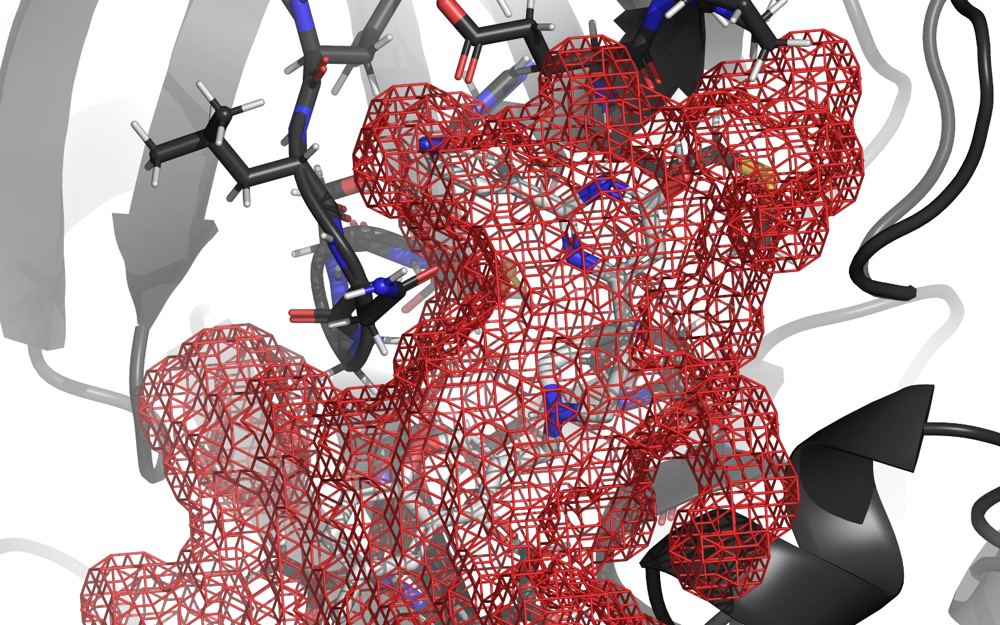

# RxTx Home

> RxTx is advancing the pharmaceutical drug research by improving the scientific software behind the scenes.

## Consulting services

Here at RxTx, we offer high-throughput virtual screening and software development services that will enable and accelerate your drug discovery or academic basic research.

### High-throughput virtual screening

High-throughput virtual screening (HTVS) is not a straight-forward one-size-fits-all process and there are a plethora of issues that need to be addressed before committing yourself to it. We offer multiple levels of support and HTVS protocols based on customer needs. As we all know, every research project is unique and we will do our best to offer the exact type of analysis and simulations you require. You can leave everything from preparing simulation systems to end-point analysis to us, as well as literature search and guidance of the earliest steps of research. We are committed to providing regular updates, weekly journal clubs, and transparent documentation upon agreement.

### Software development and integration

We offer software development based on customer or partner needs. For example, [RxDock](https://rxdock.gitlab.io/), the open source molecular docking software we [modernized](research.md), or [GROMACS](https://www.gromacs.org/), the open source molecular dynamics simulation software we use and customize, can also be extended to fit your needs. Our services as software developers include adding a new feature, e.g. develop a new module that implements a particular method, improving existing functionality, e.g. customizing the existing code for solving a particular problem, extending the API for your particular requirements, fixing a particular issue as soon as possible, and integrating open-source software into your workflow.

## High-throughput virtual screening web service

High-throughput virtual screening web service is presently in development. Contact us to be notified when it becomes available.

## Vision and outlook

### Computational chemistry landscape

Bioinformatics (computational informatics) is an interdisciplinary field that develops methods and software tools for understanding biological data. It is a field that was born during a [Human Genome Project](https://www.genome.gov/) in the last decade of the 20th century, and it is a field that revolutionized almost every aspect of biomedical science and gave birth to many fields within molecular biology and modern biochemistry.

The main reason for this biomedical Renaissance is the fact that every core aspect of computational biology was open source, every part of the code and algorithms was standardized, and any research group in the world – from scientific giants in the USA to start-ups in Asia or Africa – could contribute to the scientific field, freely collaborate and grow exponentially and without any legal barrier.

Unlike bioinformatics, computational chemistry did not take that path.

The history of computational chemistry software toolbox is mired with proprietary software and high-cost entry barrier to anyone starting their medicinal chemistry training, setting up modern drug discovery laboratory in academia, or financing their research as a fledgling CRO. Quite simply put – cutting-edge computational drug discovery tools have a hefty price tag on them.

But that is not the biggest issue. The biggest issue for professional users is the lack of control you have while using proprietary software. Your experiments are run in a black-box kind of environment, where each functionality is properly documented, but the back-end of the software is never revealed nor it can be tinkered with. In an industry where funding is not an issue, but each week, day, or literally hour can mean the difference between landing a product worth dozens of billions of euros or going bust, having complete and utter control over your workflow is often a matter of life and death.

On the other side, a great number of free-to-use computational tools emerged in academia. While it was a step in the right direction, it did not allow collaboration and most of the projects failed to give desired results or stopped their development after lead scientists retired or took up other projects. The lack of control over your workflow is still present, and more often than not the project just dies with the project call funding end, group leaders eventually start to have some other goal or any other similar reason.

Paradoxically, the need for high-throughput virtual screening (HTVS) toolbox was never greater than today, and scientists across academia and industry face one of two choices – secure a tremendous amount of funding for building or renting infrastructure needed to perform drug discovery virtual pipeline and provide extensive training to their students or employees and – either secure licensing for proprietary software or make do with unoptimized software of yore.

We at RxTx choose neither of these options. We decided to base our products on [open source](research.md) from the ground up.

### Free and open-source software drug discovery platform

[RxDock](https://rxdock.gitlab.io/) is a [free and open-source software (FOSS)](https://en.wikipedia.org/wiki/Free_and_open-source_software) for HTVS and it alleviates both of these problems. While it is not using the most advanced algorithms (at least yet) and it is not the most optimized HTVS package compared to the best commercial software (yet), it gives you complete control over the code and your workflow.

Since it is open source by default you can use it for free and start using it immediately via [GitLab](https://gitlab.com/rxdock/rxdock) or [GitHub](https://github.com/rxdock/rxdock). Unlike academic freeware, you can also tinker with the code, implement the new features in the code, improve and optimize existing features, expand the documentation on the existing feature set, etc. Being a part of [the RxDock community](https://rxdock.gitlab.io/forum/) is not just about being a passive user of the product with no say in how the software will grow and evolve.

You are an active contributor and an active part of a community that will iterate on the existing version of RxDock and makes it better, more feature-rich, and more optimized with each commit. You can also fork your version of RxDock and make an independent version that will make your vision of the HTVS package come true.

My team at RxTx and me honestly can not wait to see what will the community build around RxDock and how it will be integrated into your workflow. We will be making blog posts about basic usage of RxDock as well as a separate development diary our [Scientific Software Architect Vedran Miletić](research.md) will be writing targeted at developers who would like to start developing for and around RxDock. Feel free to follow RxDock development on [GitLab](https://gitlab.com/rxdock/rxdock), [GitHub](https://github.com/rxdock/rxdock), and get updates from RxTx on [LinkedIn](https://www.linkedin.com/company/rxtx) and [Twitter](https://twitter.com/rxtxresearch) accounts. Also, do not hesitate to [contact us](#contact-us). We wish you all the best in the present holiday season and we can't wait to see what will 2023 bring to RxDock.

### Modern drug discovery funnel

Developing a new drug from an idea to a successful product is a complex process that can take up to 20 years and cost more than €1 billion. The early drug discovery and development process is a massive search function for remedies that demonstrate desirable changes in a biological system with minimum negative impact. It is a highly imperfect science, yet crucial for guiding the early concept of a biologically active molecule to a marketed pharmaceutical product.

Modern pharmaceutical companies are measured by the size of their compound libraries – these millions of compounds are initially screened *in silico* to generate hundreds or thousands of hits, hits are then optimized into promising lead compounds, leads are screened *in vitro* and *ex vivo* to optimize properties, followed by the ultimate step of clinical trials. This process is known as a Drug Discovery Funnel.

The attrition of this process is astronomical, where hundreds of thousands or millions of compounds generate one clinical trial drug candidate. These candidates fail during clinical trials more often than not, mostly due to poor translational research models and inappropriate *in vivo* disease models.

### High-throughput virtual screening in drug discovery

Structure-based drug discovery (SBDD) is becoming an essential tool in assisting fast and cost-efficient lead discovery and optimization. SBDD is nowadays central to the efficient development of therapeutic agents and the understanding of metabolic processes. SBDD is proven to be more efficient than the traditional way of drug discovery since it aims to understand the molecular basis of disease and utilizes the knowledge of the three-dimensional (3D) structure of the biological target in the process.

State-of-the-art structure-based drug design methods include virtual screening (VS) and *de novo* drug design; these serve as an efficient, alternative approach to HTS. In virtual screening, large libraries of drug-like compounds that are commercially available are computationally screened against targets of known structure, and those that are predicted to bind well are experimentally tested.

In the *de novo* drug design approach, the 3D structure of the receptor is used to design structurally novel molecules that have never been synthesized before using ligand-growing programs and the intuition of the medicinal chemist

Virtual screening (VS) is a computational technique used in drug discovery to search libraries of small molecules to identify those structures which are most likely to bind to a drug target, typically a protein receptor or enzyme. High-throughput virtual screening (HTVS) is a VS technique where search libraries count from a few thousand to a few million compounds, screened against one or more targets. HTVS requires a powerful computational engine to perform screening in a time-efficient manner, as well as extensive pre-processing and post-processing tools.

## Contact us

For all inquiries please reach out to us via the contact form below.

<form action="https://formsubmit.co/fe14e503867dbcee1f459f050bde0d7f" method="POST">
    

        <label for="name">Name</label> 
        <input type="text" name="name" style="border: 1px solid black; width: 100%" required>
    

    

        <label for="email">Email</label> 
        <input type="email" name="email" style="border: 1px solid black; width: 100%" required>
    

    

        <label for="message">Message</label> 
        <textarea name="message" style="border: 1px solid black; width: 100%; height: 5rem" required></textarea>
    

    <input type="text" name="_honey" style="display:none">
    <button class="md-button md-button--primary" type="submit">Send</button>
</form>
